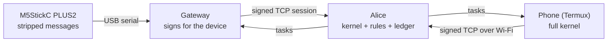

# SC-OS One-Pager

As of 2026-09-17. Details in [README.md](README.md), [CHANGELOG.md](CHANGELOG.md) and [NOTES.md](NOTES.md).

## What SC-OS is

SC-OS lets agents exchange **capsules**: signed, validated, content-addressed messages that say how far to believe them, not just what was said. Each claim carries a confidence and evidence, each capsule lists what its sender doesn't know, and provenance records what it was derived from.

Trust is earned from outcomes, never from receipt. Every node holds a private opinion per topic and per rule: a **value** from −2 to +2, where +1 means unknown, and a **weight**. Only an observed success (+0.1, weight +1) or failure (−0.2, weight +3) moves it. Left untested, weight decays by one law, **Leighton Weight**: W(t) = W₀·e^(−kt), and the value drifts back to unknown.

The thesis: SC-OS is a seed, not a blueprint. A small invariant kernel plus one decay law grows into whatever system its environment and hardware allow.

The kernel runs on full Python. Small devices speak a stripped format, and a gateway turns their messages into full capsules and signs them on their behalf.

## What has been demonstrated

One rule, `verify-high-confidence-risk`, has earned trust from four agents on real hardware: Bob, Carol, a phone and an M5StickC PLUS2. It reached the +2.0 maximum on successes and dropped on failures exactly as the model predicts. All 152 tests pass.

| Area | Shown by |
| --- | --- |
| Identity and replay | Keys pinned on first contact; forged hellos, tampering, key changes and byte-identical replays rejected, also across restarts (tests and real runs) |
| Two machines | Windows PC ↔ Android phone in Termux over Wi-Fi: pinning, replay rejection, dropped connections, overlapping sessions; clock offset measured as −1.0 s / +1.0 s from each side |
| Learning rules | Rules are signed capsules; outcomes move their trust only when reported by the agent that did the task, counted once; trust survives restarts |
| Edge device | M5StickC PLUS2 on MicroPython: tilt report → Alice's rule → task on its screen → button A/B → outcome counted |
| Sensor descriptions | The stick describes 8 sensors; the gateway builds a signed `__sensors__` capsule with margins as evidence; Alice stores it |
| Sensor trust | The stick sends readings; Alice checks them for physical plausibility herself and each sensor earns its own opinion (all seven readable sensors judged plausible on the device) |
| The law | Asserting tests for decay, trajectories and sharing; they found a real bug (decay counted twice) that was fixed |
| Self-description | SC-OS stores its own code, tests, decisions and limits as signed capsules |

Several bugs appeared only on real processes or hardware and were fixed: lost socket messages, a forged hello poisoning a pin, a screen driver crashing in a boot loop, and serial frames lost on the device.

## Honest limits

SC-OS is a working v0.1 on one hotspot, not a deployable system. The main gaps:

- **Star topology.** Everything talks to one node, Alice; there is no relaying and no queue for offline agents.
- **Identity is trust on first use.** Whoever says hello first gets pinned; there is no key registry or rotation.
- **An outcome is the reporter's word.** Alice checks who reported and counts it once, but can't check it is true; on the stick it is a button press.
- **The gateway holds every device's key.** Whoever controls the gateway can speak as its devices, and it forgets pending tasks when restarted.
- **Plausible isn't correct.** Sensors earn trust from physical plausibility checks, which catch impossible readings but not a sensor that is steadily wrong. Margins are firmware defaults, not an operator's.
- **Trust lives only in each node's database.** Lose the file and every opinion restarts at unknown.
- **Known defects.** A merged capsule never passes validation, and the edge link is USB serial, not ESP-NOW radio.
- **Not tested.** NAT, lossy links, more than a handful of peers, and any automated two-machine test.

## What's next

Next is the operator's side: a `__setup__` capsule that supplies margins and pinouts instead of firmware defaults.

1. **`__setup__` capsule.** Operator-supplied margins and pinouts replace firmware defaults.
2. **HAL as an interface.** Transport, clock and sensor bus as protocols, with a simulated sensor bus on the PC.
3. **Bootstrap.** Signed genesis, then hardware, setup and sensor capsules at every boot.
4. **ESP-NOW between two boards,** with a second ESP32 as the gateway radio.
5. **One hand-spawned child node,** then automated growth.

Smaller fixes queued: decide who a merged capsule is from, and persist the gateway's task table.
