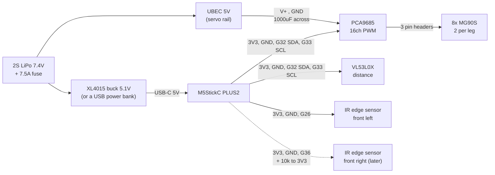

# Wiring: M5StickC PLUS2 quadruped

Everything the stick drives or reads, and how it is powered. Pin numbers are the ESP32's
(as printed on the stick), channel numbers are the PCA9685 chip's (0–15, not the board's labels).

## Overview

Two power rails, one ground: the servo rail (UBEC → PCA9685 V+) and the logic rail (stick 3V3 →
PCA9685 VCC, ToF, edge sensors). Their grounds meet at the PCA9685's terminal.

## Stick to the boards

| Stick pin | Goes to | Notes |
| --- | --- | --- |
| 3V3 (top header) | PCA9685 **VCC**, ToF VIN, edge sensors VCC | Logic only, about 70 mA in total |
| GND | PCA9685 **GND** (header), ToF GND, edge sensors GND | One ground, joined at the PCA9685 terminal |
| G32 (Grove) | PCA9685 **SDA**, ToF **SDA** | One I2C bus, two devices: `0x40` and `0x29` |
| G33 (Grove) | PCA9685 **SCL**, ToF **SCL** | |
| G26 (top header) | front left edge sensor **OUT** | Read with the pin's pull-up; unplugged reads as an edge |
| G36 (top header) | front right edge sensor **OUT** (later) | No internal pull-up: add **10 kΩ from G36 to 3V3** |
| USB-C | buck at 5.1 V, or a USB power bank | Never from the servo rail |

Unused and best avoided: **G0** (microphone clock, and a boot pin), **G25** (shares the header pin
with G36), **pin 34** (microphone data).

## Servo power

| From | To | Notes |
| --- | --- | --- |
| 2S LiPo (7.4 V) + inline fuse 7.5 A | UBEC input | The UBEC needs 7 V or more; it can't run from 5 V |
| UBEC output, **set to 5 V** | PCA9685 green terminal **V+ / GND** | Check the selection before connecting servos: 7.4 V destroys MG90S |
| 1000 µF, 16 V or more | across V+ and GND at the terminal | Absorbs servo current spikes; without it, brownouts and jitter |

Peak draw is 3–4 A with several legs moving, about 1–1.5 A walking. Use 20 AWG or thicker for V+
and GND. Put the switch on the servo rail only, so the legs stay dead while flashing.

## Servo channels

Two servos per leg, hip (swing) first, knee (lift) second.

| Leg | Hip | Knee | Board labels |
| --- | --- | --- | --- |
| Front left | 0 | 1 | 1, 2 |
| Front right | 4 | 5 | 5, 6 |
| Rear left | 11 | 12 | 12, 13 |
| Rear right | 14 | 15 | 15, 16 |

Each servo's plug goes on the PCA9685's three-pin header for its channel: brown/black to the
outside (GND), red in the middle (V+), orange/white to the inside (PWM).

## Do not

- Power **V+ from the stick**, or join the header's V+ pin to it: that pin is the servo rail.
- Put **5 V on VCC, SDA or SCL**. The stick's pins are 3.3 V and the ToF shares the bus.
- Power the **edge sensors from 5 V**: their outputs pull up to their own supply and would drive
  5 V into G26 and G36.
- Select **7.4 V** on the UBEC, or leave the XL4015 at its factory setting (about 20 V).

## Bring-up order

1. Set and **measure** each regulator with nothing connected: UBEC 5.0 V, buck 5.1 V. Lock the
   buck's potentiometer.
2. Power off. Connect V+ / GND to the PCA9685 and fit the capacitor.
3. Stick on USB, **servo rail off**: the bus should show `0x40` and `0x29`, and every channel starts
   with no pulses (servos limp).
4. **Robot lifted**, servo rail on: move one channel at a time to find each joint, its direction and
   its centre.
